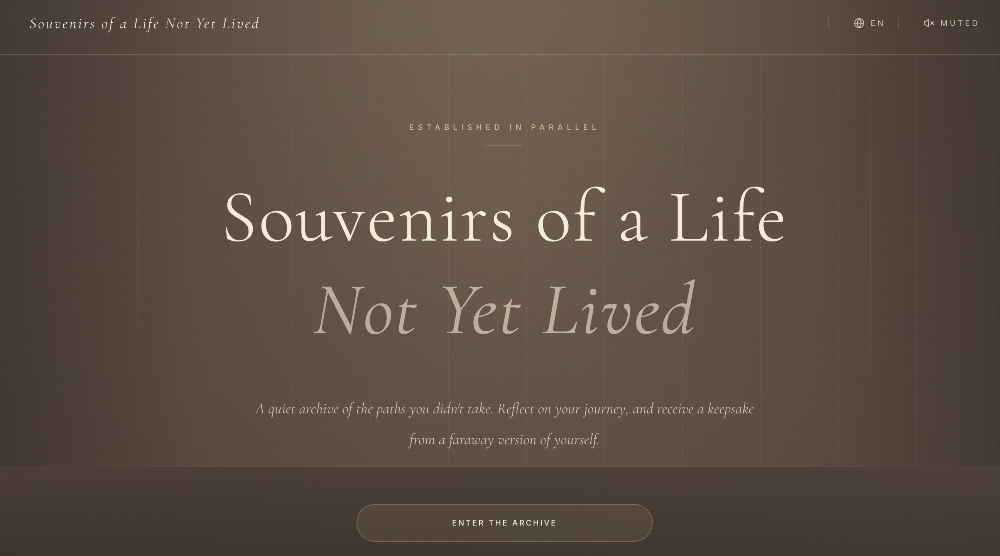
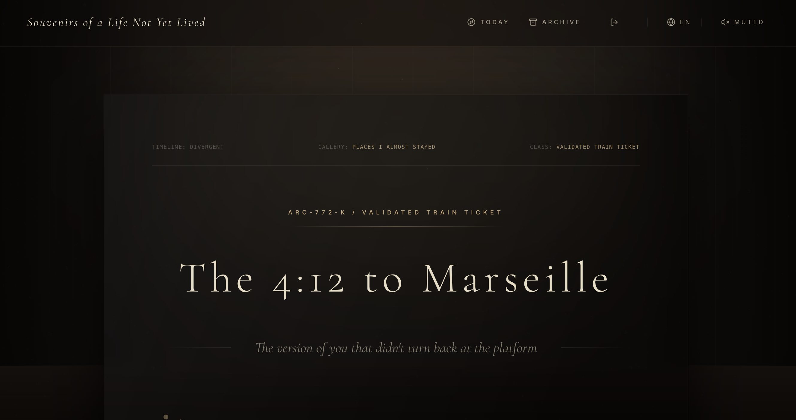
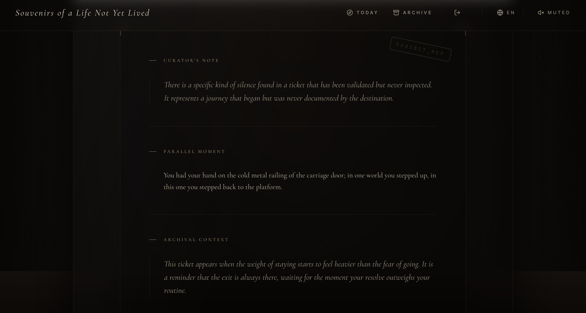
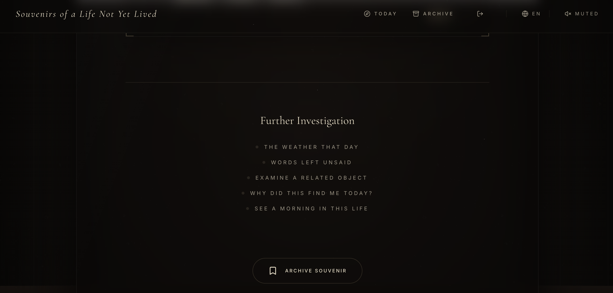
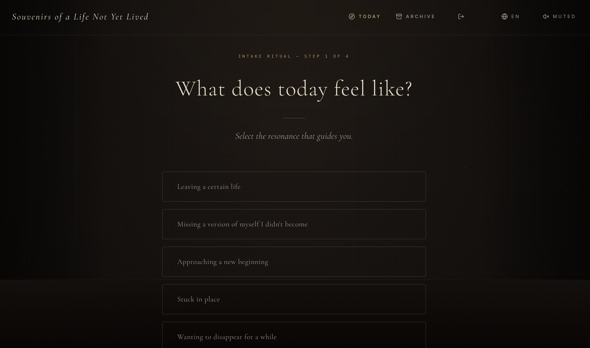

# Souvenirs of a Life Not Yet Lived

*A quiet archive of the paths you did not take.*

[**Live App**](https://souvenir-of-a-life.vercel.app/entry) · [**GitHub Repository**](https://github.com/olivia3395/Souvenir_of_a_life)

**Souvenirs of a Life Not Yet Lived** is an immersive AI travel app where users step into a private archive of the lives they almost lived. Instead of planning a trip, it invites users to reflect on longing, hesitation, becoming, and parallel selves, then receive an emotionally resonant keepsake from that unlived life — a ticket, a note, a receipt, or another small object carrying the residue of a life not fully lived.

Designed as a cinematic museum rather than a typical productivity tool or travel planner, the experience unfolds through mood-based intake, archival storytelling, curator-style notes, and collectible souvenirs that can be saved into a personal archive.

## ✨ Concept

This project began with a question:

> What if the lives we did not live still left something behind for us?

Not a grand answer.  
Just a small object. A ticket. A folded note. A train receipt.  
Something ordinary, intimate, and faintly worn by time.

Each souvenir in this app belongs to a parallel life the user never fully entered, but may still quietly long for. The product turns that idea into an immersive web experience: part archive, part emotional travel ritual, part private museum.

## 🌙 Features

- **Immersive archive-style landing page**  
  A cinematic entrance into the world of unlived lives.

- **Multi-step intake ritual**  
  Users do not just type a mood; they help shape the kind of life, threshold, and object they are approaching.

- **Emotionally grounded souvenir generation**  
  The app generates everyday keepsakes rather than ornate antiques:
  - train tickets
  - receipts
  - notes
  - postcards
  - small personal artifacts

- **Curator-style storytelling**  
  Each result is framed like a museum object, with archival context and emotional interpretation.

- **Deeper artifact exploration**  
  Users can continue into:
  - curator’s notes
  - parallel moments
  - related objects
  - further investigation prompts

- **Archive / collection system**  
  Souvenirs can be saved and revisited as part of an evolving personal archive.

- **Cinematic visual system**  
  Layered dark museum tones, warm spotlighting, subtle grain, and archival typography.

### Intake Ritual

### Souvenir Reveal

### Curator Note / Artifact Context

### Further Investigation

##  Product Philosophy

This is **not** a typical travel app.

It does not optimize routes, recommend hotels, or generate itineraries.  
Instead, it explores a softer question:

**What kind of life have you been quietly standing outside of?**

The app treats travel not as logistics, but as emotional projection — a way of imagining another rhythm, another decision, another self. Each generated keepsake is meant to feel less like content and more like something you might once have tucked into a coat pocket and rediscovered years later.

